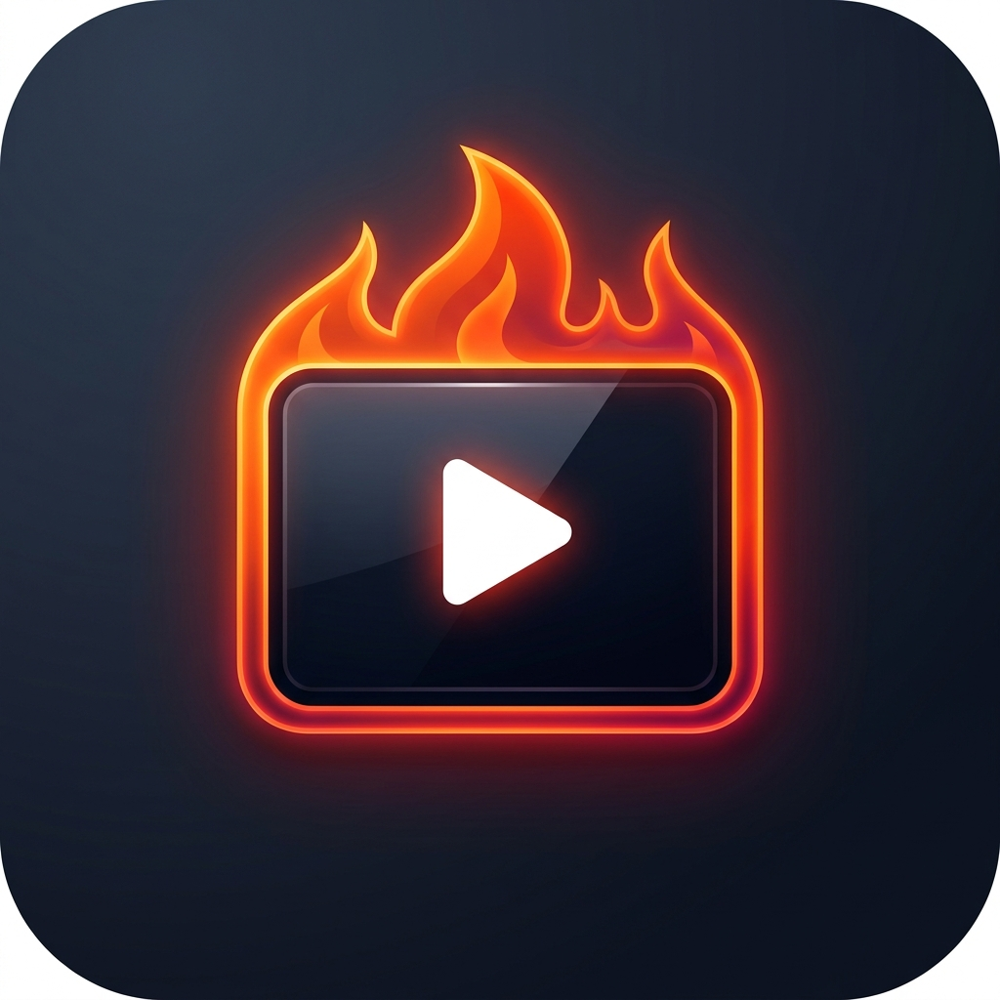
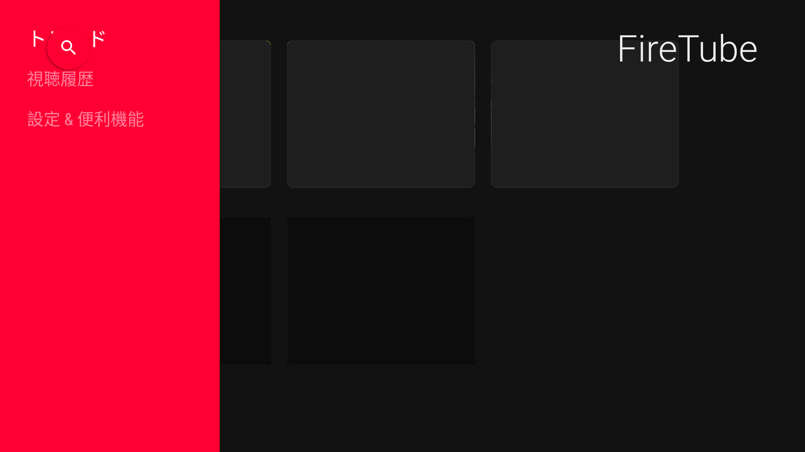
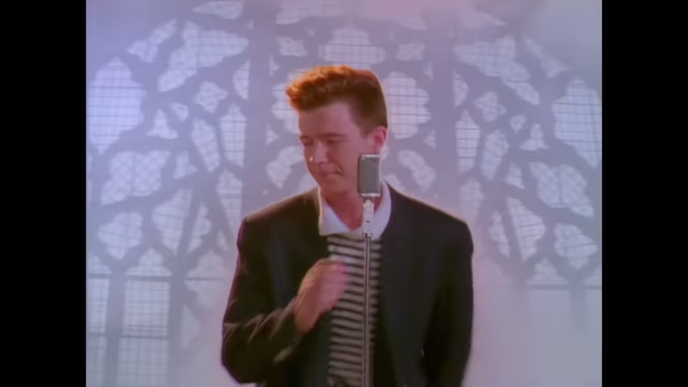
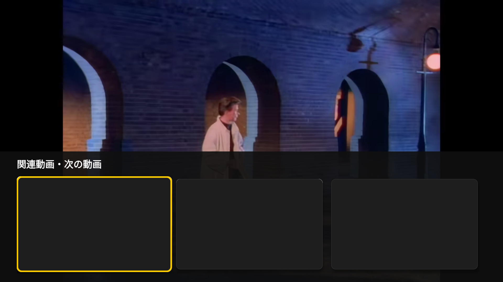
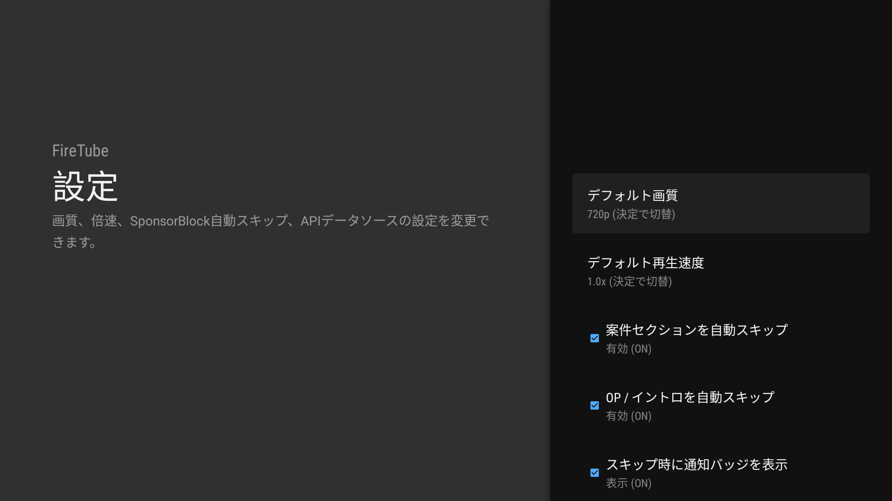
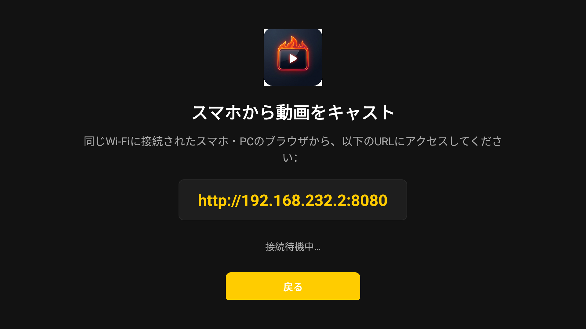

<div align="center">



# FireTube (Fire TV Dedicated YouTube Client)

**Amazon Fire TV Stick HD (Fire OS 7〜8 / 1.5GB RAM) 専用 YouTube ネイティブクライアント**

[](https://github.com/iwa-kasoutuuuuuka/FireTube/releases/latest)
[](https://developer.amazon.com/fire-tv)
[](LICENSE)
[](#)

[📥 **最新の APK をダウンロード (GitHub Releases)**](https://github.com/iwa-kasoutuuuuuka/FireTube/releases/latest)

</div>

---

## 📖 概要

**FireTube** は、低スペックな Fire TV Stick HD（物理RAM 1.0GB〜1.5GB環境）でも一切もっさりせず、**爆速かつサクサク軽快に動作すること**を追求して設計された専用YouTubeクライアントアプリです。

WebView（ブラウザベース）を1%も使用せず、**AndroidX Leanback** と **Media3 ExoPlayer**、そして公式JSON直結の **YouTube InnerTube API** / **Piped API** / **NewPipeExtractor** の多重化耐障害アーキテクチャにより、100%途切れない高可用性を実現しています。

---

## 📸 スクリーンショット

<div align="center">
  
  
</div>
<div align="center" style="margin-top: 10px;">
  
  
</div>
<div align="center" style="margin-top: 10px;">
  
</div>

---

## 🚀 主な機能と特徴

| 機能 | 内容・技術仕様 |
| :--- | :--- |
| **3重フォールバック高可用性** | **YouTube InnerTube API (公式JSON直結)** ⇄ **NewPipeExtractor** ⇄ **Piped API** の自動多重フォールバック。YouTubeのDOM変更やブロックがあっても停止せず、常時安定して動画を取得。 |
| **完全ネイティブ UI (60fps)** | 低スペック端末でカクつきの原因となる Compose を排し、テレビ専用に最適化された **AndroidX Leanback** を採用。物理リモコン操作時にフォーカスが吸い付くように移動し、拡大アニメーション＋ネオンゴールド枠線で現在位置を明確にハイライト。 |
| **GMS 0% & データレベル完全広告フリー** | 生ストリーム（HLS/DASH/MP4）のみを直接抽出するため、広告セグメントが一切混入せず完全広告フリー。 |
| **SponsorBlock 自動スキップ** | 有志データベースと再生タイムラインを同期し、動画内の案件セクション・OP/ED区間をミリ秒単位で完全自動スキップ（HUDバッジ通知付き・設定で個別ON/OFF可能）。 |
| **関連動画（Up Next）カルーセル** | 再生中にリモコンの「**下キー (D-Pad Down)**」を押すだけで、画面下部にシームレスに関連動画行がスライドイン。決定キーで瞬時に次の動画へ切り替え。 |
| **スマホからのローカルキャスト** | テレビ側で超軽量HTTPサーバー（ポート8080）が稼働。同一Wi-Fiにいるスマホのブラウザから動画URLを送信するだけで、テレビで即座に再生開始。 |
| **テレビ専用設定画面 (Leanback Settings)** | リモコンでワンタッチ切替できる設定メニュー：デフォルト画質（1080p/720p/480p）、倍速、SponsorBlockスキップ対象、優先APIデータソースの永続管理。 |
| **スマート・リモコン操作ショートカット** | ・**早送りキー長押し**: 再生速度ワンタッチ切り替え（`1.0x` → `1.25x` → `1.5x` → `2.0x`）<br>・**巻き戻しキー長押し**: 等速（`1.0x`）へ即時リセット<br>・**D-Pad 左右 / 早送り・巻き戻し単押し**: 10秒シーク<br>・**D-Pad 下キー**: 関連動画カルーセル表示 |
| **極限の低RAM（1.5GB以下）チューニング** | ・**Glide**: サムネイルを `RGB_565`（2 bytes/pixel）に固定し画像メモリを50%削減。キャッシュを最大ヒープの10%に厳格制限。<br>・**ExoPlayer**: 先読みバッファを15秒〜30秒（最大32MB）に制限し、OOM強制終了を完全防止。<br>・**Surface即時解放**: バックグラウンド移行時に動画描画Surfaceを即時アンバインド。 |
| **プライベート・ローカル同期** | 視聴履歴・再生位置レジュームを端末内の **Room Database** にローカル保存。Googleアカウントログイン不要でプライバシー完全保護。 |

---

## 📥 インストール方法 (APK)

### 1. APK の直接ダウンロード
リリース一覧ページより最新の APK ファイルをダウンロードしてください。

- **[GitHub Releases ページ（最新APKダウンロード）](https://github.com/iwa-kasoutuuuuuka/FireTube/releases)**

### 2. Fire TV Stick へのインストール手順
1. Fire TV の「設定」→「マイ Fire TV」→「開発者向けオプション」で「ADBデバッグ」と「未登録アプリのインストール」を **オン** にします。
2. PC と同一 Wi-Fi に接続し、PC のターミナルから ADB でインストールします：
   ```bash
   adb connect <Fire_TV_の_IPアドレス>:5555
   adb install -r FireTube-v1.1.0.apk
   ```
   ※ または Fire TV アプリストアの「Downloader」アプリを使って上記 GitHub Releases の APK URL から直接ダウンロード・インストールすることも可能です。

---

## 🎮 物理リモコン操作仕様

Fire TV 付属の Alexa 音声認識リモコン（物理キー）のみで全操作が完結します。

```
[リモコンキー]          [FireTube内アクション]
----------------------------------------------------------------------
D-Pad (上下左右)    :  動画カード・カテゴリ行のフォーカス移動（拡大・ネオンゴールド枠線）
決定 (Center/OK)    :  動画選択・再生 / 再生中の一時停止トグル
戻る (Back)         :  前の画面に戻る / 関連動画カルーセルを閉じる
再生 / 一時停止     :  再生・一時停止の即時切り替え
早送り (FF)         :  短押し: +10秒シーク / 長押し: 再生速度切り替え (1.0x → 1.25x → 1.5x → 2.0x)
巻き戻し (RW)       :  短押し: -10秒シーク / 長押し: 再生速度リセット (1.0x)
下キー (DPAD_DOWN)  :  再生中に「関連動画（Up Next）」カルーセル表示
```

---

## 🖥️ 開発 & エミュレーター環境構築

PC 上の Android Studio エミュレーターで、Fire TV Stick 実機環境（解像度 1080p、RAM 1.5GB制限、D-Padナビゲーション）を完全再現するスクリプトが用意されています。

```powershell
# Fire TV Stick HD 最適化 AVD 自動構築スクリプトの実行
.\setup_firetv_emulator.ps1
```

### ソースコードからのビルド
```bash
# Debug APK のビルド
./gradlew assembleDebug

# 生成場所: app/build/outputs/apk/debug/app-debug.apk
```

---

## 📜 ライセンス

本プロジェクトは [GPL-3.0 License](LICENSE) の下で公開されています。
YouTubeストリーム抽出部には [NewPipeExtractor](https://github.com/TeamNewPipe/NewPipeExtractor) を使用しています。
