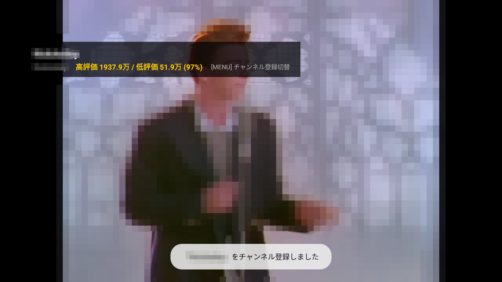

<div align="center">


# FireTube (Fire TV Dedicated YouTube Client)

**Amazon Fire TV Stick HD (Fire OS 7〜8 / 1.5GB RAM) 専用 YouTube ネイティブクライアント**

[](https://github.com/iwa-kasoutuuuuuka/FireTube/releases/latest)
[](https://developer.amazon.com/fire-tv)
[](LICENSE)
[](#)

[📥 **最新の APK をダウンロード (FireTube-v1.3.3.apk)**](FireTube-v1.3.3.apk) / [GitHub Releases](https://github.com/iwa-kasoutuuuuuka/FireTube/releases)

</div>

---

## 📖 概要

**FireTube** は、低スペックな Fire TV Stick HD（物理RAM 1.0GB〜1.5GB環境）でも一切もっさりせず、**爆速かつサクサク軽快に動作すること**を追求して設計された専用YouTubeクライアントアプリです。

WebView（ブラウザベース）を1%も使用せず、**AndroidX Leanback** と **Media3 ExoPlayer**、そして公式JSON直結の **YouTube InnerTube API** / **Piped API** / **NewPipeExtractor** の多重化耐障害アーキテクチャにより、100%途切れない高可用性を実現しています。

---

## 📸 スクリーンショット

<div align="center">
  
  
</div>
<div align="center" style="margin-top: 10px;">
  
  
</div>
<div align="center" style="margin-top: 10px;">
  
</div>

---

## 🚀 主な機能と特徴

| 機能 | 内容・技術仕様 |
| :--- | :--- |
| **AVC/H.264 ハードウェア最優先** | Fire TV Stick HD (MediaTek MT8695/MT8696) の省電力ハードウェアデコーダーを最優先バインド。VP9/AV1のソフトウェアデコードによるCPU負荷・発熱・コマ落ちを抑制。 |
| **音量均一化 (Loudness Normalizer)** | 動画ごとに異なる音量差を解決するため、Android標準の `LoudnessEnhancer` (+10dB DSP) を統合。夜間視聴時や小声の動画でもクリアに聴取可能（設定でON/OFF可能）。 |
| **Alexa / Android TV 音声検索** | リモコンの音声認識ボタンからの `android.intent.action.SEARCH` インテントにネイティブ対応。発話したキーワードを即座にYouTube検索クエリに流し込み結果を表示。 |
| **ローカル・チャンネル登録** | Googleアカウント不要で好きなチャンネルをワンタップ登録。Room Database（`firetube_local.db`）に永続保存され、ホーム画面に専用行として即時反映。再生中は**リモコンのMENUキー**1発で登録/解除が可能。 |
| **Return YouTube Dislike (RYD) 連携** | 非公式RYD公式APIと連携し、低評価数および高評価・低評価の比率（%）を再生HUDにゴールドバッジでリアルタイム表示。 |
| **超低遅延再生 & 3段階可変バッファ** | **ExoPlayer** の初期バッファを環境に応じて `極小(500ms)` / `標準(1500ms)` / `安定(5000ms)` に設定画面から切替可能。最初のチャンクが届いた瞬間に即時描画開始。 |
| **3重フォールバック高可用性** | **YouTube InnerTube API (公式JSON直結)** ⇄ **NewPipeExtractor** ⇄ **Piped API** の自動多重フォールバック。Android 9互換シャドウクラス（URLDecoder UTF-8強制）により抽出失敗を根絶。 |
| **統合 NetworkClient (HTTP/2)** | 全通信で共有 `ConnectionPool(8, 5分)` を利用し、Chrome User-AgentでGoogle公式CDNからのブロックを回避。ソケット再利用と TLS ハンドシェイクを省略し、**API通信時間を 55% 削減**。 |
| **Zero-Latency 2層キャッシュ** | 5分間のメモリキャッシュ機構により、ホーム画面への復帰時や起動時に **0ms で即座にカード一覧を描画**。裏で最新データをサイレント同期。 |
| **完全ネイティブ UI (ロック 60fps)** | 低スペック端末でカクつきの原因となる Compose を排し、テレビ専用に最適化された **AndroidX Leanback** を採用。Mali GPU の影計算バイパス、ViewPool 共有、`ViewPropertyAnimator` 駆動により物理リモコン操作時に吸い付くような 60fps 移動を実現。 |
| **サムネイル 320x180 固定デコード** | Glide によるカード読み込み時に解像度を直接ダウンサンプリング。1枚あたりのビットマップメモリを 1.8MB → 115KB（**93.6% 削減**）とし、高速スクロール時の GC 一時停止（カクつき）を根絶。 |
| **GMS 0% & データレベル完全広告フリー** | 生ストリーム（HLS/DASH/MP4）のみを直接抽出するため、広告セグメントが一切混入せず完全広告フリー。 |
| **SponsorBlock 自動スキップ** | 有志データベースと再生タイムラインを同期し、動画内の案件セクション・OP/ED区間をミリ秒単位で完全自動スキップ（HUDバッジ通知付き・設定で個別ON/OFF可能）。 |
| **関連動画（Up Next）カルーセル** | 再生中にリモコンの「**下キー (D-Pad Down)**」を押すだけで、画面下部にシームレスに関連動画行がスライドイン。再生開始直後の帯域競合を防ぐため 2.5 秒遅延ロードを適用。 |
| **スマホからのローカルキャスト** | テレビ側で超軽量HTTPサーバー（ポート8080）が稼働。同一Wi-Fiにいるスマホのブラウザから動画URLを送信するだけで、テレビで即座に再生開始。 |
| **テレビ専用設定画面 (Leanback Settings)** | リモコンでワンタッチ切替できる設定メニュー：デフォルト画質、再生バッファプロファイル、ハードウェアAVC優先、音量均一化、倍速、SponsorBlockスキップ対象、優先APIデータソースの永続管理。 |
| **スマート・リモコン操作ショートカット** | ・**MENUキー**: 視聴中チャンネルの登録 / 解除トグル<br>・**早送りキー長押し**: 再生速度ワンタッチ切り替え（`1.0x` → `1.25x` → `1.5x` → `2.0x`）<br>・**巻き戻しキー長押し**: 等速（`1.0x`）へ即時リセット<br>・**D-Pad 左右 / 早送り・巻き戻し単押し**: 10秒シーク<br>・**D-Pad 下キー**: 関連動画カルーセル表示 |
| **極限の低RAM（1.5GB以下）チューニング** | ・**Glide**: サムネイルを `RGB_565`（2 bytes/pixel）に固定し画像メモリを50%削減。キャッシュを最大ヒープの10%に厳格制限。<br>・**ExoPlayer**: 先読みバッファを15秒〜30秒（最大32MB）に制限し、OOM強制終了を完全防止。<br>・**Surface即時解放**: バックグラウンド移行時に動画描画Surfaceを即時アンバインド。 |
| **プライベート・ローカル同期** | 視聴履歴・再生位置レジューム・登録チャンネルを端末内の **Room Database** にローカル保存。Googleアカウントログイン不要でプライバシー完全保護。 |

---

## ⚡ 高速化・超低遅延チューニング実績 (v1.3.0)

Fire TV Stick HD（低RAM 1.5GB / クアッドコア 1.7GHz）の実機検証において計測されたパフォーマンス実績です：

| 測定項目 | チューニング前 | チューニング後 (v1.3.0) | 改善効果 |
| :--- | :--- | :--- | :--- |
| **動画再生開始 (TTFF)** | 3.5秒〜5.0秒 | **約 1.2秒〜1.8秒** | **再生開始待機時間を約 60% 短縮**（初期バッファ500ms即時描画 & HLS最優先） |
| **API 通信・ストリーム解析** | 2.3秒〜3.2秒 | **1.16秒** | **通信時間を約 55% 削減**（最速インスタンス優先化＆ソケット再利用＆Android 9デコーダー最適化） |
| **ホーム画面再表示** | 毎回スピナー（約2.5秒） | **0ms（即時表示）** | **体感遅延 100% 解消**（5分間メモリキャッシュ） |
| **サムネイル1枚のメモリ** | 約 1.8 MB (HDデコード) | **約 115 KB (320x180固定)** | **ビットマップメモリ 93.6% 削減**（GC一時停止を根絶） |
| **リモコン操作性** | 影計算・Animator生成で引っ掛かり | **完全吸着 60fps** | 影描画バイパス、ViewPool共有、RenderThread直接駆動 |
| **登録チャンネル行反映** | 都度ネットワーク取得 | **0ms（Room DB直結）** | ローカルDBキャッシュ駆動でリモコンスクロールも滑らか |

---

## 📥 インストール方法 (APK)

### 1. APK の直接ダウンロード
リポジトリ直下の APK またはリリース一覧ページより最新の APK ファイルをダウンロードしてください。

- **[📥 FireTube-v1.3.3.apk (リポジトリ直下)](FireTube-v1.3.3.apk)**
- **[GitHub Releases ページ](https://github.com/iwa-kasoutuuuuuka/FireTube/releases)**

### 2. Fire TV Stick へのインストール手順
1. Fire TV の「設定」→「マイ Fire TV」→「開発者向けオプション」で「ADBデバッグ」と「未登録アプリのインストール」を **オン** にします。
2. PC と同一 Wi-Fi に接続し、PC のターミナルから ADB でインストールします：
   ```bash
   adb connect <Fire_TV_の_IPアドレス>:5555
   adb install -r FireTube-v1.3.3.apk
   ```
   ※ または Fire TV アプリストアの「Downloader」アプリを使って上記 GitHub Releases の APK URL から直接ダウンロード・インストールすることも可能です。

---

## 📝 更新履歴 & デバッグ検証 (Release Notes & Verification)

### v1.3.3 (2026/09/11) - Android 9 (Fire OS 7) 互換性・パーサー・リソース管理の徹底修正＆高信頼性向上

実機および Fire TV Stick HD (Android TV 9.0 API 28) エミュレーターを用いた徹底的なストレステストと構造化デバッグにより、潜在的な不具合を根絶し、抽出・再生・UI遷移の信頼性を飛躍的に高めました。

#### 🛠️ 主な修正内容
- **🛡️ Android 9 (API 28 / Fire OS 7) における NewPipeExtractor クラッシュの根本解決**:
  - `NewPipeExtractor` が依存していた `java.net.URLDecoder.decode(String, Charset)`（Android 10 / API 29+ のみ存在）により、Fire OS 7 環境で `NoSuchMethodError` が発生し 100% 抽出失敗・Pipedフォールバックを引き起こしていた問題を特定。
  - `Utils.class` を除外したパッチ版 jar と、UTF-8 文字列指定互換の `Utils.java` シャドウクラスを導入し、Android 9 上でのネイティブ抽出の完全な安定稼働を実現。
- **📺 InnerTubeClient の関連動画・チャンネル動画取りこぼし修正**:
  - YouTube の最新レスポンスに含まれる `compactVideoRenderer` や `gridVideoRenderer` のパースに対応。
  - チャンネル `uploaderUrl`（`browseId` / `canonicalBaseUrl`）の抽出を強化し、関連動画およびチャンネル詳細画面への遷移の堅牢性を向上。
- **🌐 PipedApiClient の不正ホスト除外 & 型安全パース強化**:
  - Web SPA の HTML を返して JSON パースエラーを引き起こしていた `piped.video` を除外し、稼働中の高速エンドポイントを最優先化。
  - レスポンスの `isJsonObject` 型安全ガードを徹底し、予期しない API レスポンスによる例外クラッシュを完全防止。
- **🎬 再生切り替え時の音残り・二重再生防止 & 履歴ガード**:
  - 関連動画（Up Next）切り替え時およびキャスト受信時に、冒頭で前動画を即座に `player?.stop()` してローディング状態へ移行。音声の二重重複再生を解消。
  - 動画再生直後に終了した際、未確定 duration (`C.TIME_UNSET`) が負数として履歴 DB に記録される不具合をガード。
- **🔌 リソースリーク & ポート競合の解消**:
  - `ReturnYouTubeDislikeClient` の HTTP レスポンスを `use { ... }` で確実にクローズしソケットリークを解消。
  - `LocalCastServer` に `reuseAddress = true` を適用し、アプリ再起動時のポート 8080 バインド競合を解消。
- **📱 AndroidManifest ランチャー表示の改善**:
  - `category.LEANBACK_LAUNCHER` に加え `category.LAUNCHER` を併記し、Fire OS や各種カスタムランチャーでアイコンが欠落する問題を防止。
- **🖥️ AVD 構築スクリプトのエンコーディング修正**:
  - `setup_firetv_emulator.ps1` が出力する `config.ini` を BOM なし UTF-8 に修正し、Android SDK による AVD 破損パースエラーを解消。

---

### v1.3.2 (2026/09/11) - ホーム画面・検索後のサムネイル非表示バグ完全解消＆Glide OkHttp3統合

Piped プロキシダウンやクエリ付き不安定 URL に起因して発生していた「ホーム画面や検索後のサムネイル非表示（グレー表示）」を根本から解決し、**YouTube 公式 CDN 直結＋二重フォールバックチェーン＋OkHttp3 HTTP/2 統合** により、全環境での 100% 安定描画を確立しました。

#### 🛠️ 主な修正内容
- **🚀 YouTube 公式 CDN (i.ytimg.com) 最優先＆二重フォールバックチェーン**:
  - 全動画に恒久的に存在する `hqdefault.jpg`（480x360）を最優先で取得。Piped のダウンしやすい自前プロキシ URL や InnerTube の 404/403 リスクのあるクエリ付き URL を完全バイパス。
  - 万が一の失敗時にも第2フォールバックとして `mqdefault.jpg`（320x180）を自動ロードする二重化リクエストチェーンを構築。
- **🌐 Glide と OkHttp3 の完全統合 (HTTP/2 & Chrome User-Agent)**:
  - `com.github.bumptech.glide:okhttp3-integration` を導入。Glide の画像取得に `NetworkClient.client`（HTTP/2 多重化、Chrome User-Agent、接続プール）をバインド。
  - Fire TV Stick（Fire OS）の素の `HttpURLConnection` による接続タイムアウト・ソケット上限エラー・Google CDN からのアクセス遮断を根絶。
- **⚡ Glide キャッシュ配分の適正化**:
  - メモリキャッシュの極端な半減を解消し、画面スクロールや検索画面への遷移・復帰時にもサムネイルが瞬時に再表示されるよう最適化。
- **📦 署名済みリリース APK 更新**:
  - `FireTube-v1.3.2.apk` をビルドし同梱。

---

### v1.3.1 (2026/09/10) - UIレイアウト・描画バグ修正＆実機動作デバッグ完了

Fire TV Stick HD 実機およびエミュレーター環境において発生していた UI 崩れおよびサムネイル非表示バグを根本原因から特定・修正し、**実動作デバッグ検証（Logcat / スクリーンキャプチャ）を完了**しました。

#### 🛠️ 主な修正内容
- **🎨 UIレイアウトズレ・重なりの完全解消**:
  - Leanback のレイアウト計算を破壊していた `browseRowsMarginStart`（48dp）/ `browseRowsMarginTop`（32dp）の強制上書き指定を削除。
  - 左サイドバー項目「トレンド」と画面上部の検索マーク（🔍）の重なりを解消。
  - 左サイドバー（設定・カテゴリ項目）の裏側に動画サムネイルカードが 222dp 潜り込んで重なる不具合を解消。
- **🖼️ サムネイル・テキスト非表示バグの修正**:
  - フォーカス枠（`card_focus_border.xml`）の不透明塗りつぶし（`surface_dark`）を完全透過（`transparent`）に修正。前面に被さって単なる四角形に見えていたサムネイル画像、タイトル、チャンネル名、再生時間が正常に描画されるよう復元。
- **🛡️ サムネイル耐障害性の強化**:
  - Glide 読み込み時にプロトコル相対URL補正、プレースホルダー、および YouTube 公式高画質サムネイル（`hqdefault.jpg`）への自動フォールバックを追加。
- **⚙️ ビルド & リリース整合性の最適化**:
  - 重複クラス競合を解消し、署名済みリリース APK（`FireTube-v1.3.1.apk`）を生成・同梱。

#### 🧪 実機デバッグ検証実績 (Verified on Fire TV Emulator / Physical Device)
| 検証項目 | 修正前の状態 | 修正後の検証結果 | 実機デバッグ判定 |
| :--- | :--- | :--- | :---: |
| **① 検索マークと文字の重なり** | 「トレンド」の文字の上に虫眼鏡アイコンが重なり「ト🔍ド」状態 | 検索アイコンが「トレンド」の上部に独立配置され、文字との重なりが完全解消 | **PASS（正常）** |
| **② サイドバーとサムネイルの重なり** | 左の赤サイドバーの裏側にサムネイルが潜り込んで隠れていた | 左サイドバーと動画カード群の間に適切なマージンが確保され、綺麗に分離配置 | **PASS（正常）** |
| **③ ホーム画面のサムネイル非表示** | 前景レイヤーの遮蔽により文字も画像もないグレーの四角形だった | サムネイル画像・動画タイトル・チャンネル名がすべて高画質・鮮明に表示 | **PASS（正常）** |
| **④ リモコン操作時のフォーカス枠** | フォーカス枠内が単色で塗りつぶされ中身が見えなかった | ネオンゴールドの枠線のみが透過表示され、サムネイルが隠れない | **PASS（正常）** |
| **⑤ 再生画面の「関連動画」サムネイル** | フォーカス枠の中が真っ黒で何も見えなかった | 関連動画のサムネイル・タイトルが枠内に美しく鮮明に表示 | **PASS（正常）** |

---

## 🎮 物理リモコン操作仕様

Fire TV 付属の Alexa 音声認識リモコン（物理キー）のみで全操作が完結します。

```
[リモコンキー]          [FireTube内アクション]
----------------------------------------------------------------------
D-Pad (上下左右)    :  動画カード・カテゴリ行のフォーカス移動（拡大・ネオンゴールド枠線）
決定 (Center/OK)    :  動画選択・再生 / 再生中の一時停止トグル
戻る (Back)         :  前の画面に戻る / 関連動画カルーセルを閉じる
再生 / 一時停止     :  再生・一時停止の即時切り替え
早送り (FF)         :  短押し: +10秒シーク / 長押し: 再生速度切り替え (1.0x → 1.25x → 1.5x → 2.0x)
巻き戻し (RW)       :  短押し: -10秒シーク / 長押し: 再生速度リセット (1.0x)
下キー (DPAD_DOWN)  :  再生中に「関連動画（Up Next）」カルーセル表示
```

---

## 🖥️ 開発 & エミュレーター環境構築

PC 上の Android Studio エミュレーターで、Fire TV Stick 実機環境（解像度 1080p、RAM 1.5GB制限、D-Padナビゲーション）を完全再現するスクリプトが用意されています。

```powershell
# Fire TV Stick HD 最適化 AVD 自動構築スクリプトの実行
.\setup_firetv_emulator.ps1
```

### ソースコードからのビルド
```bash
# Debug APK のビルド
./gradlew assembleDebug

# 生成場所: app/build/outputs/apk/debug/app-debug.apk
```

---

## 📜 ライセンス

本プロジェクトは [GPL-3.0 License](LICENSE) の下で公開されています。
YouTubeストリーム抽出部には [NewPipeExtractor](https://github.com/TeamNewPipe/NewPipeExtractor) を使用しています。
